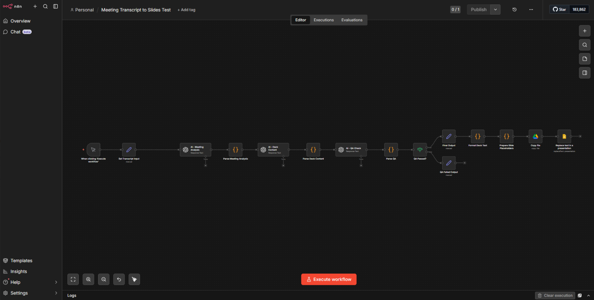

# AI Meeting Presentation Agent (n8n Native)

An enterprise-grade automation that transforms meeting transcripts into structured executive presentations using n8n and OpenAI.

[](https://opensource.org/licenses/MIT)
[](https://n8n.io/)
[](https://openai.com/)

## 🚀 Overview

The **AI Meeting Presentation Agent** provides a "reliable, single-workflow" solution for analyzing discovery calls and generating slide decks. Built natively in **n8n**, it eliminates the need for maintaining custom code while providing a robust QA layer for executive-ready outputs.

### Workflow Visualization


### Key Logic
1. **Meeting Analysis**: Extracts a structured business summary using GPT-4o-mini.
2. **Slide Mapping**: Transforms the analysis into specific slide content.
3. **QA Validation**: Self-evaluates the output against business standards (word counts, tone).
4. **Slide Generation**: Automatically copies a Google Slides template and populates it.

## 📋 Repository Structure

```text
ai-meeting-agent/
├── workflow/
│   └── meeting_to_slides_n8n.json  # Import this into n8n
├── docs/
│   ├── architecture.md             # Mermaid diagram of nodes
│   └── setup_guide.md              # Setup & credentials guide
└── samples/
    └── transcript_sample.txt       # Example discovery call transcript
```

## 🛠️ Getting Started

1. **Import**: Load the `.json` file from the `workflow/` folder into your n8n instance.
2. **Configure**: Set up your Google Cloud and OpenAI credentials in n8n.
3. **Template**: Point the workflow to your Google Slides Template ID: `1vXhzzhoypMD2V5ayDzN0IB5RybMcGVAEx8XIoysc8qk`.

For detailed steps, see the [Setup Guide](docs/setup_guide.md).

## 📊 Business Value
- **Time Savings**: Reduces post-meeting reporting time by ~80%.
- **Consistency**: Ensures every meeting produces a high-quality summary and deck.
- **Reliable Output**: Built-in AI-driven QA gate prevents poor quality slides from being created.

## 📜 License
Internal Technical Test Project.
