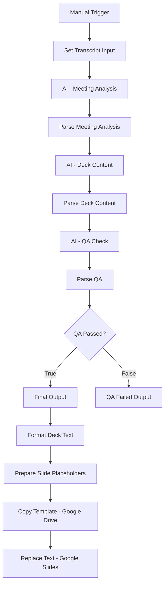

# Solution Architecture - AI Meeting Presentation Agent

This document outlines the end-to-end automation architecture for transforming meeting transcripts into executive presentations. The solution is built exclusively using **n8n** for orchestration, **OpenAI** for intelligence, and **Google Workspace** for output.

## Workflow Overview

The system follows a linear logic path with a built-in Quality Assurance (QA) gate to ensure all generated content meets executive standards before any files are created.

## Functional Components

### 1. Ingestion & Analysis
- **Transcript Input**: The raw text from the discovery call is ingested into the workflow.
- **AI Analysis (GPT-4o-mini)**: Extracts core themes, objectives, and action items using strict structured output prompts.

### 2. Content Generation
- **Deck Content Logic**: Maps the abstract meeting analysis into slide-by-slide content (Title, Executive Summary, Objectives, Action Items, Next Steps).

### 3. Quality Assurance (QA)
- **Validation Gate**: A dedicated AI node evaluates the generated slide content against business rules (e.g., word count limits, professional tone, factual grounding).
- **Conditional Branch**: If the QA check fails, the workflow terminates without creating a "bad" presentation, protecting the professional integrity of the output.

### 4. Google Workspace Integration
- **Drive Automation**: Clones a master Google Slides template to create a new, unique file for the specific meeting.
- **Slides Automation**: Uses the `batchUpdate` method to replace all `{{PLACEHOLDERS}}` with the final, formatted text.

## Benefits of this Architecture
- **Low-Code/High-Reliability**: No python dependencies or server maintenance required.
- **Auditable**: Every step of the transformation is visible and loggable within n8n.
- **Scalable**: Easily adaptable to other slide templates or output formats (e.g., Email, Slack).
