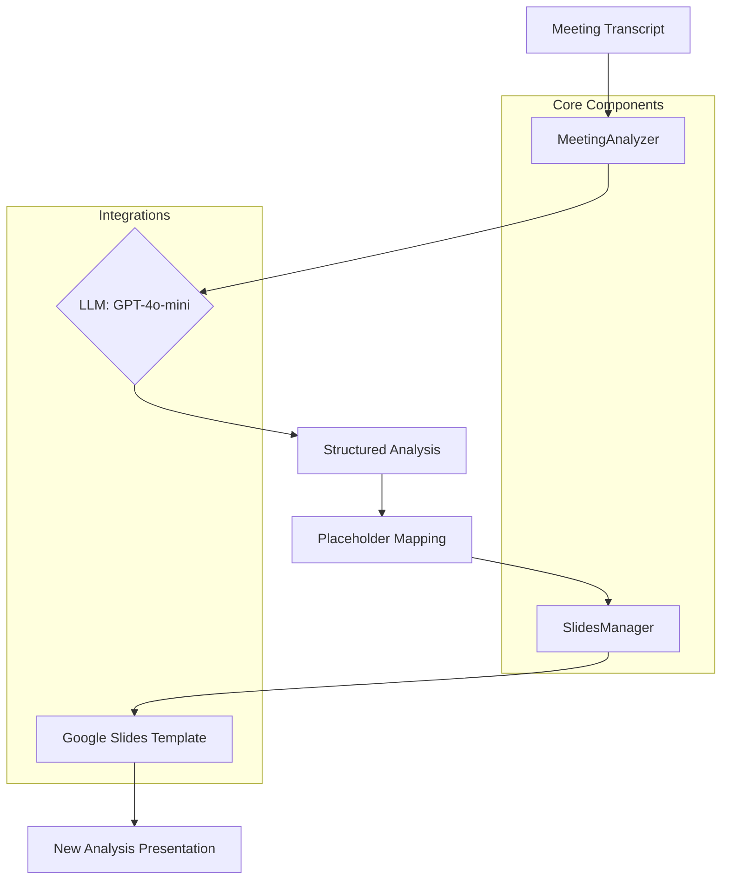

# AI Meeting Presentation Agent - Architecture

## Workflow Overview
1. **Extraction**: The CLI reads the raw transcript file.
2. **Analysis**: The `MeetingAnalyzer` uses OpenAI's Structured Outputs to extract a `MeetingAnalysis` Pydantic model.
3. **Mappig**: Analysis data is mapped to specific placeholders like `{{TITLE}}`, `{{EXEC_BULLET_1}}`, etc.
4. **Generation**: `SlidesManager` clones the Google Slides template and performs a `batchUpdate` to create the final deck.
